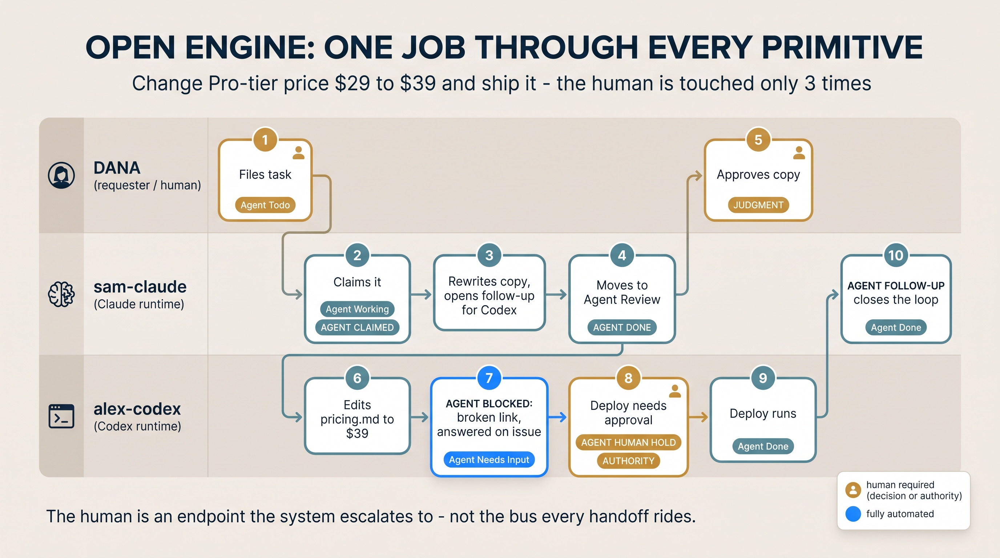

# Open Engine — Adoption Assessment & Work-Mode Distillation

A small research-and-decision journey: studying **Open Engine** (a system for handing off
work between AI agents), deciding whether a *solo developer* should adopt it, and distilling
its most valuable idea into a reusable prompt template that needs zero infrastructure.

## The journey

1. **Studied the source.** Worked through Open Engine — Nate B. Jones' design for a shared
   task queue that lets Claude, ChatGPT, and Codex hand off work without a human acting as
   the copy-paste glue between them.
2. **Dissected the architecture.** Produced [`REPORT.md`](REPORT.md) — a deep teardown of
   Open Engine as a distributed task-queue / blackboard system whose message bus happens to
   be a human-readable issue tracker, plus the transferable design principles behind it.
3. **Asked the real question:** is this worth installing for a **solo developer who doesn't
   use Linear**? The answer — and its justification — is in
   [`open-engine-adoption-assessment.md`](open-engine-adoption-assessment.md): **skip full
   adoption for now**, because nearly every component (shared queue, locking, routing,
   receipts) only earns its keep under multi-agent or multi-person conditions.
4. **Kept the valuable part.** Distilled Open Engine down to three habits that transfer
   without any setup — captured as a paste-and-go prompt in
   [`work-mode-template.md`](work-mode-template.md):
   - **Work mode, not prompt mode** — explain the *job* (result, sources, boundaries, stop
     condition), not just ask for *output*.
   - **One scoped task, then stop** — one unit of work = one unit you can check.
   - **Leave a receipt** — *Did / Didn't / Proof / Next* makes the work inspectable.
5. **Battle-tested it.** Ran the template on a real extraction task, which surfaced a
   refinement worth keeping: **completeness ("all", "every") can't be verified** without
   redoing the work — so `DONE WHEN` should lean on *traceability*, *method*, and *declared
   gaps* instead.

## Worked trace — one job through every primitive

This is the capstone of the dissection (REPORT.md §8): a single job — *change the Pro-tier
price from $29 to $39 and ship it* — flowing across two agents, a data-block, and a deploy
gate. The gold cards are the **only three moments a human is touched** (file the job, approve
the copy, approve the deploy); everything else is automated.

## Live slide deck

The whole architecture dissection is also a self-contained **10-slide deck** —
**[open it live →](https://az9713.github.io/open-engine-adoption-assessment/open-engine-architecture.html)**
(← → or click to page; deep-links to `#1`–`#10`). It's one HTML file with no build
step: imported from a [Claude Design](https://claude.ai/design) project and
re-implemented to run standalone, swapping the design-system runtime for ~45 lines that
size each 1920×1080 slide to the viewport.

## What's here

| File | What it is |
|---|---|
| [`open-engine-adoption-assessment.md`](open-engine-adoption-assessment.md) | The decision record: why skip full adoption now, when to revisit, and the distilled prompt |
| [`work-mode-template.md`](work-mode-template.md) | The 3-habit work-mode prompt template, with worked examples and an anti-pattern |
| [`REPORT.md`](REPORT.md) | Full architecture dissection of Open Engine + transferable design principles |
| [`open-engine-10-steps.png`](open-engine-10-steps.png) | The worked-trace diagram above (REPORT.md §8), as a standalone image |
| [`open-engine-architecture.html`](open-engine-architecture.html) | Self-contained 10-slide architecture deck ([view live](https://az9713.github.io/open-engine-adoption-assessment/open-engine-architecture.html)) — the dissection as slides |

> Raw source material (video transcript, article text, the Open Engine guide) is **not**
> redistributed here — see the linked originals below.

## Source references

- **Video** — *"I Was The Only Thing Connecting Claude, ChatGPT, and Codex. So I Built My
  Replacement."* — https://www.youtube.com/watch?v=QSK4vf_ZTRA
- **Substack** — *"Grab the Open Engine guide: the copy-paste task record that makes one
  AI's work the next AI's job, with receipts"* (Nate's Newsletter) —
  https://natesnewsletter.substack.com/p/ai-agent-handoffs

## The one-line takeaway

When intelligence becomes cheap, the moat moves to the **work layer** — the context and
handoffs that don't leave your system on their own. For a solo developer, the three habits
above *are* that lesson, sized for one person; the full Open Engine is what you graduate to
the day you're routing work between multiple agents or a teammate by hand.
